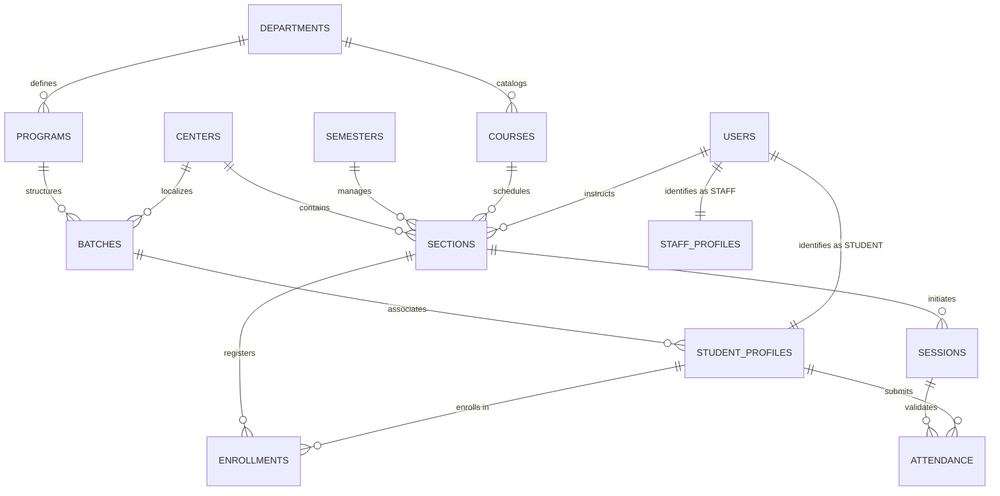

<div align="center">
  
  <h1>HU-AMS: Haramaya University Attendance Management System</h1>
  <p><strong>A Final Year Computer Science Capstone Project</strong></p>
  <p align="center">
    <i>Bridging Academic Integrity with Modern Geofencing Technology</i>
  </p>
</div>

<hr />

## 🎓 Executive Summary
The **Haramaya University Attendance Management System (HU-AMS)** is a robust, full-stack enterprise-grade solution engineered to digitize and automate the attendance tracking process across Haramaya University's diverse campuses and academic programs. Developed as a final year Computer Science project, the system addresses the critical need for verifiable, real-time attendance data by integrating **Smart Geofencing**, **Cryptographic Session Tokens**, and **Automated Enrollment Synchronization**.

## 🏛 System Architecture & Design
HU-AMS is built on a highly normalized relational database architecture, ensuring data consistency and strict adherence to university academic structures (Departments -> Programs -> Batches -> Students).

### Core Components
1.  **Identity & Access Management (IAM)**: Secured role-based authentication for Administrators, Instructors, and Students.
2.  **Geographical Verification Layer**: Utilizes the Haversine formula and device GPS sensors to enforce physical presence requirements via configurable geofences.
3.  **Active Session Synchronization**: Real-time coordination between instructor-led sessions and student marking windows using dynamic JWT-backed tokens.
4.  **Administrative Intelligence**: Centralized control for managing batches, centers, and global academic status (Promotion/Advancement).

---

## 📊 Relational Data Modeling (ERD)

The persistence layer is managed via a PostgreSQL schema, optimized for high-concurrency attendance events.



---

## 🛠 Technology Stack (Modern Web Standards)

### Frontend Environment
-   **Framework**: React 18 (Functional Components & Hooks)
-   **Language**: TypeScript (Strict Type Checking)
-   **Styling**: Tailwind CSS with custom Design Tokens (HU-Gold/Primary)
-   **State & Animation**: React Context API & Motion (Framer)
-   **Data Visualization**: Recharts for attendance analytics

### Backend Architecture
-   **Runtime**: Node.js 20+
-   **Application Server**: Express.js
-   **Database**: PostgreSQL
-   **ORM/BaaS**: Supabase Admin SDK for secure relational operations
-   **Security**: JSON Web Tokens (JWT) for session persistence

---

## 🚀 Business Logic & Automated Workflows

### 1. Autonomous Enrollment (The "Always-Sync" Principle)
HU-AMS utilizes PostgreSQL Triggers to maintain real-time enrollment accuracy, removing manual intervention:
-   **`sync_enrollment_on_student_change`**: Reacts to student batch/center updates by automatically adjusting enrollment in all active academic sections.
-   **`sync_enrollment_on_section_change`**: Instantly populates new course sections with students who intersect the section's Batch and Center requirements.

### 2. Spatiotemporal Verification
-   **Spatial**: Cross-references student GPS coordinates against the Section's defined `geofenceCenter` and `radius`.
-   **Temporal**: Enforces `token_expiry` windows and `late_threshold` logic, automatically classifying attendance as **Present**, **Late**, or **Absent**.

### 3. Identity Separation
Specific data profiles for **Regular** (2 semesters/year) and **Extension** (3 semesters/year) programs ensure the system respects HU's varied academic calendars.

---

## 📁 Repository Structure

```text
/
├── api/                    # Serverless API routes (Express.js)
├── server/                 
│   ├── db/                 # HU-AMS Client (Database configuration)
│   └── services/           # Academic logic & bulk import services
├── src/                    # Frontend Client
│   ├── components/         # Atomic UI components
│   ├── pages/              # Domain-specific views (Admin/Instructor/Student)
│   └── App.tsx             # Application Router
├── HU_AMS_SCHEMA.sql       # Core Database Definition
├── HU_AMS_MIGRATIONS.sql   # Versioned Database Modifications
└── vercel.json             # Deployment manifest
```

---

## ⚙️ Deployment & Configuration

Ensure a `.env` file is configured with the following parameters:
```bash
VITE_SUPABASE_URL=...
VITE_SUPABASE_ANON_KEY=...
SUPABASE_SERVICE_ROLE_KEY=...
JWT_SECRET=...
```

**Designed and Implemented for Haramaya University.**
*Faculty of Computing and Informatics | Computer Science Department*
